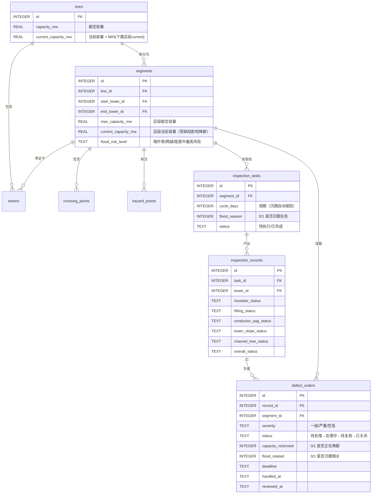
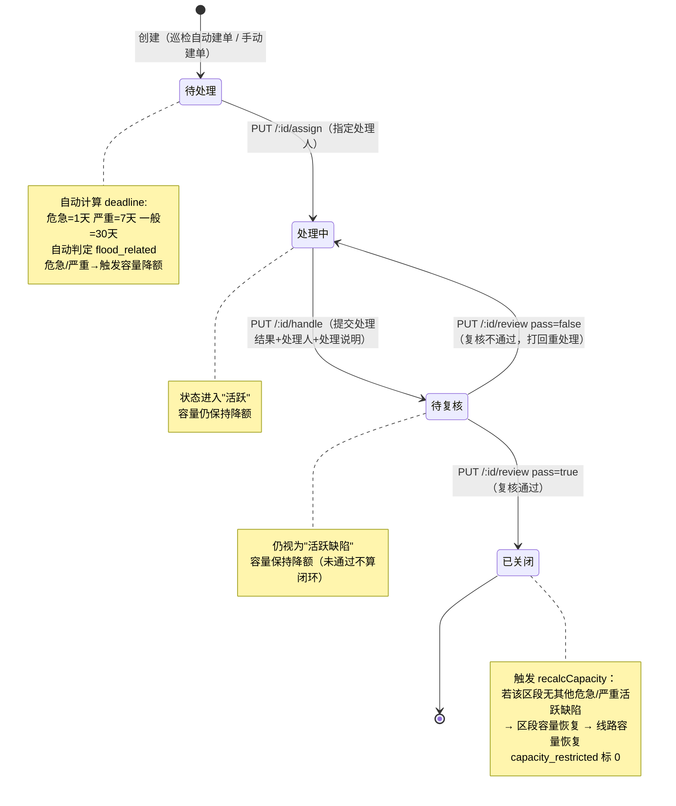

# 风电送出线路巡检系统 — 缺陷全流程协作说明

> 本文档基于现有代码实现梳理，面向运维开发、产品和业务人员，讲清各模块如何协作、一条危急缺陷从上报到关闭会改动哪些状态、哪些统计会被带动。

---

## 一、模块关系总览

系统由 6 层实体自上而下构成，前三层是资产建档，后三层是巡检与消缺闭环：

| 层级 | 实体（表） | 关键字段 | 协作说明 |
|------|-----------|---------|---------|
| L1 | `lines` 线路 | `capacity_mw` 额定容量、`current_capacity_mw` 当前容量 | 最上层资产，当前容量取下属所有区段当前容量的最小值（瓶颈原则） |
| L2 | `towers` 杆塔 | `line_id`、`slope_flood_risk` 边坡汛期风险 | 线路上的基塔，两端杆塔界定一个区段 |
| L3 | `segments` 区段（线路分段） | `start_tower_id`、`end_tower_id`、`max_capacity_mw`、`current_capacity_mw`、`flood_risk_level` | **容量降额的直接操作层**。汛期风险等级取两端杆塔、区内跨越点、区内隐患点三者中的最高风险 |
| L4 | `inspection_tasks` 巡检任务 | `segment_id`、`cycle_days`、`flood_season`、`status` | 按区段按周期生成，汛期高风险区段周期自动加密 |
| L5 | `inspection_records` 巡检记录 | `task_id`、`tower_id`、5 个分项状态 + `overall_status` | **缺陷上报入口**。一条记录对应一基杆塔的一次巡检，分项异常自动触发缺陷工单 |
| L6 | `defect_orders` 缺陷工单 | `severity` 分级、`status` 状态、`capacity_restricted` 是否限制容量、`flood_related` 是否汛期相关 | **全流程核心实体**。危急/严重缺陷会连带触发区段和线路的容量降额 |

辅助表：`crossing_points`（跨越点）、`hazard_points`（隐患点），参与区段汛期风险的聚合计算。

### 实体关联图



**核心代码位置：**
- 数据库表结构：[db.js](file:///Users/ding/Documents/SOLOCODE%203/0619/macmini/zj-00403-sendline-5/src/db.js#L16-L210)
- 容量降额核心函数 `recalcCapacity`：[defects.js#L5-L69](file:///Users/ding/Documents/SOLOCODE%203/0619/macmini/zj-00403-sendline-5/src/routes/defects.js#L5-L69)
- 区段汛期风险聚合 `recalcSegmentFloodRisk`：[segments.js#L54-L99](file:///Users/ding/Documents/SOLOCODE%203/0619/macmini/zj-00403-sendline-5/src/routes/segments.js#L54-L99)
- 巡检记录自动生成缺陷：[records.js#L116-L210](file:///Users/ding/Documents/SOLOCODE%203/0619/macmini/zj-00403-sendline-5/src/routes/records.js#L116-L210)

---

## 二、各模块协作机制详解

### 2.1 线路分段（区段）如何建档

- 一条 `lines` 按杆塔拆成多个 `segments`，每个区段由 `start_tower_id` 和 `end_tower_id` 两个杆塔锚定。
- 区段自带 `flood_risk_level`（汛期风险等级：低/中/高），可人工设定，也可通过接口 `POST /api/segments/:id/recalc-flood-risk` **自动聚合**：
  - 取两端杆塔的 `slope_flood_risk`
  - 取区内所有 `crossing_points` 的 `flood_risk_level`
  - 取区内所有 `hazard_points` 的 `flood_risk_level`
  - 三者取最高等级作为区段汛期风险（`高 > 中 > 低`）

### 2.2 巡检任务如何按周期生成

- `generateTasks()` 每日 6:00 由 cron 自动触发，也可手动 `POST /api/tasks/generate`。
- 基础周期由区段的 `icing_risk`（覆冰风险）决定：**高→15天、中→20天、低→30天**。
- **汛期（5-9月）加密**：若当前月份在 5~9 月，则叠加 `getFloodRiskCycle()`：
  - 高汛期风险区段：周期 × 0.4，最低 3 天
  - 中汛期风险区段：周期 × 0.6，最低 5 天
  - 低风险：不变
- 生成的任务 `flood_season` 标记 0/1，便于统计汛期待检任务量。

**代码位置：** [tasks.js#L11-L63](file:///Users/ding/Documents/SOLOCODE%203/0619/macmini/zj-00403-sendline-5/src/routes/tasks.js#L11-L63)

### 2.3 巡检记录上报如何自动生成缺陷工单

`POST /api/records` 时，系统自动扫描 5 个巡检分项：

| 巡检分项字段 | 自动生成的缺陷类型 | 严重等级映射 |
|-------------|------------------|------------|
| `insulator_status` | 绝缘子缺陷 | 危急→危急、异常→严重、其他→一般 |
| `fitting_status` | 金具缺陷 | 同上 |
| `conductor_sag_status` | 导线弧垂异常 | 同上 |
| `tower_slope_status` | 塔基边坡异常 | 同上（同时自动标汛期相关） |
| `channel_tree_status` | 通道树障 | 同上（同时自动标汛期相关） |

- 每条记录可触发 **多条** 缺陷工单（一基杆塔可能同时有绝缘子+金具+树障缺陷）。
- 工单 `deadline` 按严重等级自动计算：**危急 1 天、严重 7 天、一般 30 天**。
- 汛期相关自动判定：缺陷类型包含"塔基边坡异常/塔基滑坡/通道树障/基础冲刷/防洪设施损坏/排水系统堵塞"→ `flood_related=1`。
- **关键联动**：若生成的缺陷含危急或严重等级，**立即触发 `recalcCapacity()` 进行容量降额**。

**代码位置：** [records.js#L116-L210](file:///Users/ding/Documents/SOLOCODE%203/0619/macmini/zj-00403-sendline-5/src/routes/records.js#L116-L210)

### 2.4 容量降额（recalcCapacity）的工作原理

这是整个系统最核心的协作点，**危急/严重缺陷 ↔ 区段容量 ↔ 线路容量** 三者联动。

算法步骤（`defects.js#L5-L69`）：

1. **统计区段活跃缺陷**：
   - `criticalActive` = 该区段 severity='危急' 且 status ∈ (待处理, 处理中, 待复核) 的条数
   - `seriousActive` = 该区段 severity='严重' 且 status ∈ (待处理, 处理中, 待复核) 的条数

2. **计算区段新容量**：
   - 有危急缺陷（`criticalActive > 0`）→ `current_capacity_mw = max_capacity_mw × 50%`
   - 无危急但有严重缺陷（`seriousActive > 0`）→ `current_capacity_mw = max_capacity_mw × 80%`
   - 都没有 → 恢复满额 `max_capacity_mw`

3. **打标 `capacity_restricted`**：
   - 区段内所有 危急/严重 + 活跃 的缺陷 → 标 1
   - 其余缺陷 → 标 0（一般缺陷、或已关闭的严重/危急）

4. **向上聚合到线路**：
   - 取该线路下所有区段的 `current_capacity_mw` 的 **最小值** 作为线路 `current_capacity_mw`
   - 即：**线路容量 = 最差区段的容量（瓶颈原则）**，一段受降额，全线降。

**触发时机**（共 6 处会调用 `recalcCapacity`）：
| 场景 | 代码位置 | 触发条件 |
|------|---------|---------|
| 创建缺陷工单 | [defects.js#L182-L184](file:///Users/ding/Documents/SOLOCODE%203/0619/macmini/zj-00403-sendline-5/src/routes/defects.js#L182-L184) | severity 为 危急/严重 |
| 派单（assign） | — | **不触发**（状态仍活跃，严重度未变） |
| 处理完成（handle） | [defects.js#L228-L230](file:///Users/ding/Documents/SOLOCODE%203/0619/macmini/zj-00403-sendline-5/src/routes/defects.js#L228-L230) | severity 为 危急/严重 |
| 复核通过 / 不通过 | [defects.js#L256-L258](file:///Users/ding/Documents/SOLOCODE%203/0619/macmini/zj-00403-sendline-5/src/routes/defects.js#L256-L258)、[L276](file:///Users/ding/Documents/SOLOCODE%203/0619/macmini/zj-00403-sendline-5/src/routes/defects.js#L276) | **总是触发**（复核通过可能结束活跃期） |
| 更新缺陷严重度 | [defects.js#L324-L335](file:///Users/ding/Documents/SOLOCODE%203/0619/macmini/zj-00403-sendline-5/src/routes/defects.js#L324-L335) | 严重度从/向 危急/严重 变化 |
| 删除缺陷工单 | [defects.js#L350](file:///Users/ding/Documents/SOLOCODE%203/0619/macmini/zj-00403-sendline-5/src/routes/defects.js#L350) | **总是触发** |
| 巡检记录建单 | [records.js#L207-L209](file:///Users/ding/Documents/SOLOCODE%203/0619/macmini/zj-00403-sendline-5/src/routes/records.js#L207-L209) | 生成的缺陷含 危急/严重 |
| 种子数据初始化 | [seed.js#L1093](file:///Users/ding/Documents/SOLOCODE%203/0619/macmini/zj-00403-sendline-5/src/seed.js#L1093) | 初始化后对每个区段重算一次 |

### 2.5 复核关闭流程

缺陷工单的完整生命周期有 4 个状态、3 个正向操作 + 1 个回退操作：



**状态流转操作接口汇总：**

| 操作 | 接口 | 入参 | 状态变化 | 写入字段 | 是否触发容量重算 |
|------|------|------|---------|---------|---------------|
| 建单 | `POST /api/defects` | record_id, segment_id, defect_type, description, severity | → 待处理 | status='待处理', deadline, flood_related | 危急/严重 → 是 |
| 派单 | `PUT /api/defects/:id/assign` | assignee | 待处理 → 处理中 | assignee, status='处理中' | 否 |
| 处理完成 | `PUT /api/defects/:id/handle` | handler, handle_notes | 处理中 → 待复核 | handler, handled_at, handle_notes, status='待复核' | 危急/严重 → 是 |
| 复核不通过 | `PUT /api/defects/:id/review` | reviewer, review_notes, pass=false | 待复核 → 处理中 | reviewer, review_notes, status='处理中' | 危急/严重 → 是 |
| 复核通过（关闭） | `PUT /api/defects/:id/review` | reviewer, review_notes, pass=true | 待复核 → 已关闭 | reviewer, reviewed_at, review_notes, status='已关闭' | **是** |

---

## 三、一条危急缺陷从上报到关闭 — 状态与统计全追踪

以典型场景为例：**汛期，巡检员在 II 回 S02 区段（高覆冰+高汛期风险，180MW 额定）的 T4 杆塔发现通道树障危急缺陷（乔木距导线不足 3m）。**

> 以下标注"↑"表示统计值上升、"↓"表示下降、"="表示不变、"☑ 联动生效"表示触发了跨模块副作用。

### 阶段 1：巡检上报（创建缺陷工单）

**动作**：巡检员提交 `POST /api/records`，其中 `channel_tree_status='危急'`。

**系统自动执行：**

| 受影响对象 | 字段/状态 | 变化值 | 说明 |
|-----------|----------|-------|------|
| `inspection_records` | `overall_status` | ='危急' | 记录本身 |
| `defect_orders`（新行） | `severity` | ='危急' | 由 channel_tree_status='危急' 映射 |
| | `status` | ='待处理' | 初始状态 |
| | `defect_type` | ='通道树障' | 由分项字段映射 |
| | `deadline` | =当天+1天 | 危急缺陷限期 24h |
| | `flood_related` | =1 ☑ | 缺陷类型命中汛期关键词自动标记 |
| | `capacity_restricted` | =1 ☑ | 触发 recalcCapacity 后标记 |
| `segments`（II回S02） | `current_capacity_mw` | 180MW → 90MW ↓50% ☑ | 存在危急活跃缺陷，降额至 50% |
| `lines`（II回220kV线） | `current_capacity_mw` | 180MW → MIN(区段当前容量) ☑ | 线路容量 = 下属区段容量最小值 |
| **统计联动** | | | |
| `/api/stats/summary` | `defects.by_severity.危急` | +1 ↑ | 总危急缺陷数 |
| | `defects.by_status.待处理` | +1 ↑ | |
| | `defects.overdue` | （截止次日才会计入）= | 1 天后 deadline 过期才出现 |
| `/api/stats/defect-density` | S02 区段 `defects_per_km` | +1/L km ↑ | 每公里缺陷密度 |
| `/api/stats/availability` | S02 区段 `restricted_days_30d` | 从今天开始累计 +1/天 ☑ | capacity_restricted=1 的缺陷每天贡献 1 个受限日 |
| | II回线 `capacity_ratio` | 100% → 50% ↓ | 当前容量/额定容量 |
| `/api/stats/flood-risk` | S02 区段 `active_flood_defects` | +1 ↑ | 汛期相关活跃缺陷 |
| 首页 Dashboard | 危急缺陷卡片 | 数字+1 ↑ | 红色徽章 |
| | 汛期相关缺陷 | 数字+1 ↑ | |
| | 线路容量进度条 | 从 100% 缩至 50%，颜色变红 | 容量比 <50% 用红色填充 |

---

### 阶段 2：派单（指定处理人）

**动作**：运维班长 `PUT /api/defects/:id/assign`，`body.assignee='运维二班孙七'`。

| 受影响对象 | 字段/状态 | 变化值 | 说明 |
|-----------|----------|-------|------|
| `defect_orders` | `status` | '待处理' → '处理中' | |
| | `assignee` | ='运维二班孙七' | |
| `segments.current_capacity_mw` | | =90MW 不变 | **不触发 recalcCapacity**（严重度未变，仍属活跃缺陷） |
| **统计联动** | | | |
| `/api/stats/summary` | `by_status.待处理` | -1 ↓ | 状态迁移 |
| | `by_status.处理中` | +1 ↑ | |
| `/api/stats/overdue` | （若已超 deadline） | 仍计入，状态仍属活跃 | |

---

### 阶段 3：处理完成（提交消缺结果）

**动作**：孙七砍伐了 8 棵树，剩余 3 棵次日继续，`PUT /api/defects/:id/handle`，`handler='孙七'`，`handle_notes='已砍伐通道内高大乔木8棵，剩余3棵正在处理'`。

| 受影响对象 | 字段/状态 | 变化值 | 说明 |
|-----------|----------|-------|------|
| `defect_orders` | `status` | '处理中' → '待复核' | 未闭环，仍计入"活跃缺陷" |
| | `handler` | ='孙七' | |
| | `handled_at` | =当前时间戳 | |
| | `handle_notes` | =处理说明 | |
| `segments.current_capacity_mw` | | =90MW 不变 ☑ | 虽触发 recalcCapacity，但 status='待复核' 仍算活跃缺陷，容量保持降额 |
| **统计联动** | | | |
| `/api/stats/summary` | `by_status.处理中` | -1 ↓ | |
| | `by_status.待复核` | +1 ↑ | |
| `/api/stats/availability` | `restricted_days_30d` | 继续累计 ↑ | 因 capacity_restricted 仍为 1 |

---

### 阶段 4a：复核不通过（打回重处理）

**动作**：主任复核，认为剩余 3 棵未处理完不合格，`PUT /api/defects/:id/review`，`pass=false`，`review_notes='剩余3棵未处理完毕，继续砍伐后重新提交'`。

| 受影响对象 | 字段/状态 | 变化值 |
|-----------|----------|-------|
| `defect_orders` | `status` | '待复核' → '处理中' |
| | `reviewer` | =主任姓名 |
| | `review_notes` | =打回说明 |
| `segments.current_capacity_mw` | | =90MW 不变 ☑ | 仍活跃，容量不降 |
| **统计** | `by_status.待复核` → -1，`处理中` → +1 | |

---

### 阶段 4b：复核通过（关闭工单）

**动作**（次日）：孙七完成剩余 3 棵砍伐，重新提交处理，主任复核通过，`PUT /api/defects/:id/review`，`pass=true`，`review_notes='清理彻底，通道达标，对地距离恢复安全值'`。

| 受影响对象 | 字段/状态 | 变化值 | 说明 |
|-----------|----------|-------|------|
| `defect_orders` | `status` | '待复核' → **'已关闭'** | 生命周期结束 |
| | `reviewer` | =主任姓名 | |
| | `reviewed_at` | =当前时间戳 | |
| | `review_notes` | =复核说明 | |
| | `capacity_restricted` | =1 → 0 ☑ | 已关闭，不再限制容量 |
| `segments`（II回S02） | `current_capacity_mw` | 90MW → 重新计算 ☑☑☑ | 触发 recalcCapacity：<br>① 统计 S02 剩余活跃危急缺陷=0<br>② 统计 S02 剩余活跃严重缺陷=?<br>&nbsp;&nbsp;· 若有 → 180×80% = 144MW<br>&nbsp;&nbsp;· 若无 → 恢复满额 180MW |
| `lines`（II回220kV线） | `current_capacity_mw` | → MIN(下属区段当前容量) ☑ | 线路容量重新取瓶颈区段值 |
| **统计联动** | | | |
| `/api/stats/summary` | `by_severity.危急` | **不变**（总量仍在）= | 统计的是历史总数，不是活跃数 |
| | `by_status.待复核` | -1 ↓ | |
| | `by_status.已关闭` | +1 ↑ | |
| | `defects.overdue` | 若此前超 deadline → -1 ↓ | 已关闭不再计入超期 |
| `/api/stats/repair-duration` | II回S02 区段 | **新工单纳入统计** ↑ | 消缺时长 = reviewed_at - created_at（天），计入区段平均时长、整体平均时长 |
| `/api/stats/defect-density` | S02 区段 `defects_per_km` | -1/L km ↓ | 已关闭不再计入"活跃缺陷密度" |
| `/api/stats/availability` | S02 区段 `restricted_days_30d` | **停止累计** = | capacity_restricted 已变 0，该缺陷贡献的受限天数到此为止 |
| | S02 区段 `capacity_ratio` | 50% → 100%（或 80%）↑ | 容量恢复，进度条变回绿色/黄色 |
| `/api/stats/flood-risk` | S02 区段 `active_flood_defects` | -1 ↓ | 汛期相关活跃缺陷清零 |
| `/api/stats/overdue` | items 中移除该工单 | | 已关闭不受超期统计 |
| 首页 Dashboard | 危急缺陷卡片 | 数字-1 ↓（若该工单是仅存危急活跃缺陷） | 红色数字减少 |
| | 已消缺卡片 | 数字+1 ↑ | |
| | 线路容量进度条 | 颜色从红→绿，长度恢复 | 容量比改善 |

---

## 四、全量统计接口与触发条件对照表

| 统计接口 | 核心数据源 | 何时被"危急缺陷全流程"影响 | 影响方向 |
|---------|----------|--------------------------|---------|
| `/api/stats/summary` | `defect_orders` 按 severity / status 分组 COUNT | 建单 / 派单 / 处理 / 复核 每一步状态迁移都影响 `by_status`；`by_severity` 仅在建单时+1（总数） | 迁移、计数 |
| `/api/stats/defect-density` | `defect_orders` 活跃缺陷（3 状态）COUNT / `segments.length_km` | 建单 +1/km，复核通过 -1/km，派单/处理不变 | 活跃消长 |
| `/api/stats/repair-duration` | `defect_orders` 已关闭 + `handled_at` 不为空 | **仅复核通过（关闭）时**新增一条时长记录 | 新增样本 |
| `/api/stats/overdue` | `defect_orders` 活跃 + `deadline < today` | deadline 过期后自动出现，关闭后移除 | 出现/消失 |
| `/api/stats/availability` | `segments.current_capacity_mw`、`defect_orders` (capacity_restricted=1) 的创建至关闭时间段 | 建单触发降额后 capacity_ratio↓，受限天数从 0 起累计；关闭后容量恢复，受限天数停止累计 | 降额/恢复/累计停止 |
| `/api/stats/flood-risk` | `defect_orders` 中 `flood_related=1` 的活跃缺陷 COUNT | 建单（汛期类型）+1，复核通过 -1 | 活跃消长 |

---

## 五、关键代码速查表

| 功能点 | 文件 | 行号 |
|-------|------|-----|
| 数据库表结构（全部 8 张表 + 迁移） | [db.js](file:///Users/ding/Documents/SOLOCODE%203/0619/macmini/zj-00403-sendline-5/src/db.js#L16-L210) | L16~L210 |
| 汛期判定函数 `isFloodSeason` | [db.js](file:///Users/ding/Documents/SOLOCODE%203/0619/macmini/zj-00403-sendline-5/src/db.js#L212-L216) | L212~L216 |
| 汛期巡检周期加密 `getFloodRiskCycle` | [db.js](file:///Users/ding/Documents/SOLOCODE%203/0619/macmini/zj-00403-sendline-5/src/db.js#L218-L223) | L218~L223 |
| 容量降额核心算法 `recalcCapacity` | [defects.js](file:///Users/ding/Documents/SOLOCODE%203/0619/macmini/zj-00403-sendline-5/src/routes/defects.js#L5-L69) | L5~L69 |
| 缺陷工单 5 个状态流转接口 | [defects.js](file:///Users/ding/Documents/SOLOCODE%203/0619/macmini/zj-00403-sendline-5/src/routes/defects.js#L133-L354) | L133~L354 |
| 巡检记录 → 缺陷自动生成 | [records.js](file:///Users/ding/Documents/SOLOCODE%203/0619/macmini/zj-00403-sendline-5/src/routes/records.js#L116-L210) | L116~L210 |
| 巡检任务周期生成 `generateTasks` | [tasks.js](file:///Users/ding/Documents/SOLOCODE%203/0619/macmini/zj-00403-sendline-5/src/routes/tasks.js#L11-L63) | L11~L63 |
| 区段汛期风险聚合 `recalcSegmentFloodRisk` | [segments.js](file:///Users/ding/Documents/SOLOCODE%203/0619/macmini/zj-00403-sendline-5/src/routes/segments.js#L54-L99) | L54~L99 |
| 首页统计查询 SQL（含危急/严重活跃计数） | [app.js](file:///Users/ding/Documents/SOLOCODE%203/0619/macmini/zj-00403-sendline-5/src/app.js#L64-L88) | L64~L88 |
| cron 每日 6:00 自动生成任务 | [app.js](file:///Users/ding/Documents/SOLOCODE%203/0619/macmini/zj-00403-sendline-5/src/app.js#L442-L450) | L442~L450 |
| 6 大统计接口实现 | [stats.js](file:///Users/ding/Documents/SOLOCODE%203/0619/macmini/zj-00403-sendline-5/src/routes/stats.js#L11-L500) | L11~L500 |

---

## 六、状态流转总图（含容量联动信号）

```mermaid
flowchart TD
    classDef def fill:#fef2f2,stroke:#dc2626,stroke-width:2px
    classDef seg fill:#eff6ff,stroke:#2563eb,stroke-width:2px
    classDef stat fill:#f0fdf4,stroke:#16a34a,stroke-width:2px
    classDef op fill:#fffbeb,stroke:#d97706,stroke-width:2px

    OP1[巡检上报<br>POST /records]:::op -->|自动生成| S1[缺陷状态：待处理]:::def
    OP1 -->|危急/严重| R1[☑ 触发 recalcCapacity]:::seg
    R1 -->|降额50%| CAP1[区段 current = max × 50%<br>线路 current = MIN(区段)]:::seg
    S1 -->|☑ density+1, 待处理+1| ST1[统计联动：<br>summary.待处理+1<br>density 上升<br>availability 开始累计受限天数]:::stat

    OP2[派单<br>PUT /assign]:::op --> S2[缺陷状态：处理中]:::def
    S2 -->|状态迁移 不含容量| ST2[统计联动：<br>summary.待处理-1<br>summary.处理中+1]:::stat

    OP3[处理完成<br>PUT /handle]:::op --> S3[缺陷状态：待复核]:::def
    OP3 -->|危急/严重| R2[☑ 触发 recalcCapacity]:::seg
    R2 -->|待复核仍活跃| CAP2[容量保持不变]:::seg
    S3 -->|状态迁移| ST3[统计联动：<br>summary.处理中-1<br>summary.待复核+1]:::stat

    OP4A[复核不通过<br>PUT /review pass=false]:::op --> S2
    OP4A -->|☑ 容量仍保持| R2

    OP4B[复核通过<br>PUT /review pass=true]:::op --> S4[缺陷状态：已关闭]:::def
    OP4B -->|总是触发| R3[☑ 触发 recalcCapacity]:::seg
    R3 -->|若无其他危急| CAP3[区段容量恢复：<br>·剩余严重 → ×80%<br>·都无 → 满额100%<br>☑ capacity_restricted=0]:::seg
    S4 -->|关闭联动| ST4[统计联动：<br>summary.待复核-1<br>summary.已关闭+1<br>density 下降<br>duration 新增样本<br>availability 停止累计受限<br>overdue 项移除<br>flood-risk 活跃-1]:::stat
```

---

## 七、设计要点总结

1. **容量瓶颈原则**：线路容量 ≡ 最差区段容量，保证任何一个区段的危急缺陷都会让整条线的可用容量下降，倒逼消缺优先级。
2. **"待复核"仍视为活跃**：缺陷只有复核通过关闭后才算真正消除，避免"处理了就算完成"的假闭环——容量降额保持到复核通过为止。
3. **汛期自动双加密**：任务周期变短（频次×）+ 汛期相关缺陷自动标记 + 独立的汛期风险统计视图，三者联动。
4. **5 项巡检分项 → 5 类缺陷类型**的固定映射让巡检记录录入一次即可自动完成缺陷建单，减少人工二次录入。
5. **`capacity_restricted` 标志位**：作为可用率统计的桥接字段，让 `/api/stats/availability` 可以精确计算每个区段过去 30 天因缺陷降额了多少天，而无需额外的历史表。
